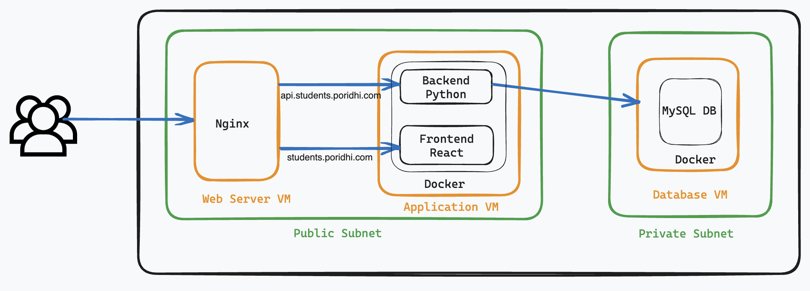

## Nginx Domain Base Routing

#### Diagram



#### Problem
###### ধরেন আপনার কাছে তিনটা সারভার আছে AWS এ। দুইটা সারভার পাবলিক সাবনেটে একটা প্রাইভেট সাবনেটে। যে সারভারটা প্রাইভেট সাবনেটে আছে সেটাতে আপনি postgres কনফিগার করলেন। আর পাবলিক সাবনেটের একটা সারভারে nginx ডেপ্লয় করলেন Docker দিয়ে। আরেকটা সারভারে দুইটা কন্টেইনার আছে। একটা হলো ফ্রন্টএন্ড কন্টেইনার ( React) আর আরেকটা হলো ব্যাকেন্ড কন্টেইনার (python অথবা node)। আপনাকে কিভাবে nginx কনফিগ লিখতে হবে যাতে করে কেউ http://students.poridhi.com এই URL এ রিকোয়েস্ট পাঠালে ফ্রন্ডএন্ড কন্টেইনারে যায়। http://api.students.poridhi.com এই URL খুজলে Backend কন্টেইনারে যাবে।


## Here is the solution
#### Nginx Configuration
```
upstream frontend {
    server application_vm_private_ip:3000; 
}

upstream backend {
    server application_vm_private_ip:8000; 
}

server {
    listen 80;
    server_name students.poridhi.com;

    location / {
        proxy_pass http://frontend;
    }
}

server {
    listen 80;
    server_name api.students.poridhi.com;

    location / {
        proxy_pass http://backend;
    }
}
```

##### Clone repository
```sh
git clone git@github.com:ravenKaisar/nginx-domain-routing.git
cd nginx-domain-routing
```

##### Authenticate your terminal by AWS Access Key & Secret Key
```sh
aws configure
```

##### Run the aws_script.sh file & create VPC, Subnet, Route Table, Internet Gateway, Nat Gateway, Security Group & 3 EC2 Instance
```sh
sh aws_script.sh
```
